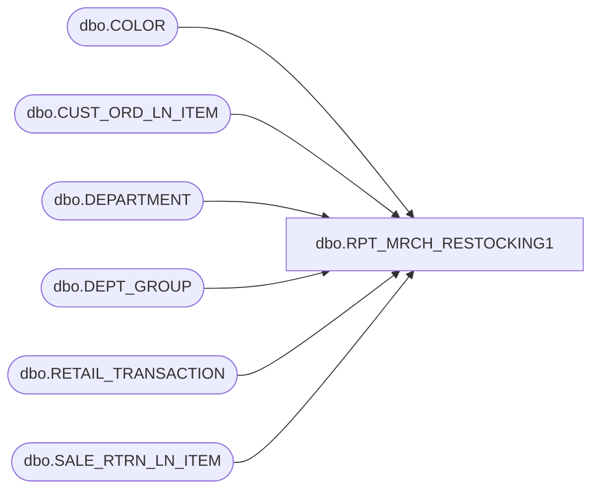

# dbo.RPT_MRCH_RESTOCKING1

**Database:** USICOAL  
**Server:** bedrockdb02  

## Architecture Diagram



## Table Dependencies

| Referenced Table |
|---|
| dbo.COLOR |
| dbo.CUST_ORD_LN_ITEM |
| dbo.DEPARTMENT |
| dbo.DEPT_GROUP |
| dbo.RETAIL_TRANSACTION |
| dbo.SALE_RTRN_LN_ITEM |

## Stored Procedure Code

```sql

```

