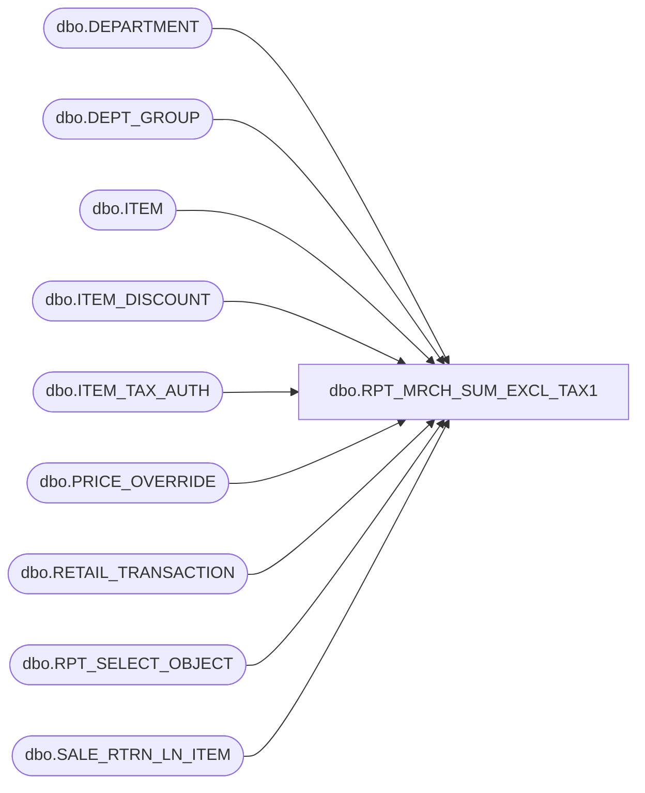

# dbo.RPT_MRCH_SUM_EXCL_TAX1

**Database:** USICOAL  
**Server:** bedrockdb02  

## Architecture Diagram



## Table Dependencies

| Referenced Table |
|---|
| dbo.DEPARTMENT |
| dbo.DEPT_GROUP |
| dbo.ITEM |
| dbo.ITEM_DISCOUNT |
| dbo.ITEM_TAX_AUTH |
| dbo.PRICE_OVERRIDE |
| dbo.RETAIL_TRANSACTION |
| dbo.RPT_SELECT_OBJECT |
| dbo.SALE_RTRN_LN_ITEM |

## Stored Procedure Code

```sql

```

