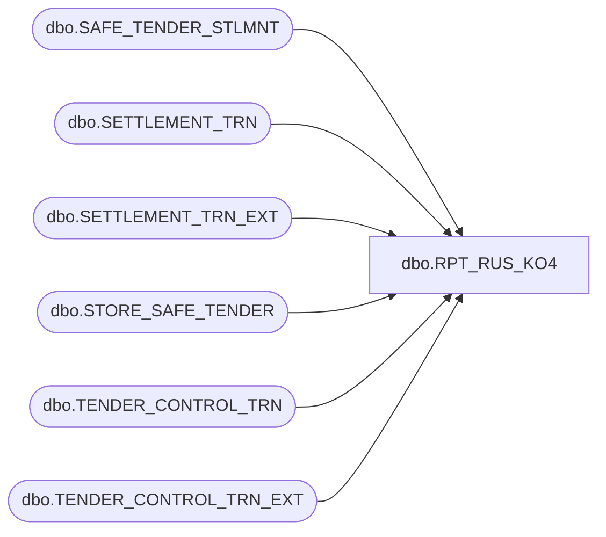

# dbo.RPT_RUS_KO4

**Database:** USICOAL  
**Server:** bedrockdb02  

## Architecture Diagram



## Table Dependencies

| Referenced Table |
|---|
| dbo.SAFE_TENDER_STLMNT |
| dbo.SETTLEMENT_TRN |
| dbo.SETTLEMENT_TRN_EXT |
| dbo.STORE_SAFE_TENDER |
| dbo.TENDER_CONTROL_TRN |
| dbo.TENDER_CONTROL_TRN_EXT |

## Stored Procedure Code

```sql

```

