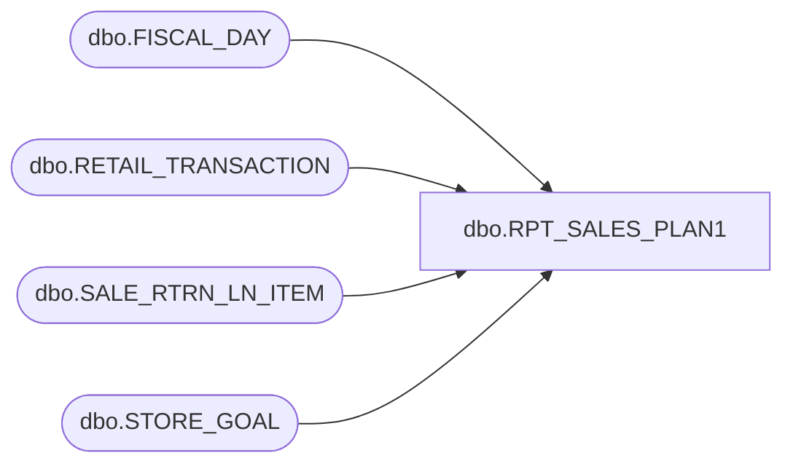

# dbo.RPT_SALES_PLAN1

**Database:** USICOAL  
**Server:** bedrockdb02  

## Architecture Diagram



## Table Dependencies

| Referenced Table |
|---|
| dbo.FISCAL_DAY |
| dbo.RETAIL_TRANSACTION |
| dbo.SALE_RTRN_LN_ITEM |
| dbo.STORE_GOAL |

## Stored Procedure Code

```sql

```

