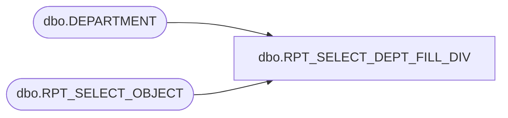

# dbo.RPT_SELECT_DEPT_FILL_DIV

**Database:** USICOAL  
**Server:** bedrockdb02  

## Architecture Diagram



## Table Dependencies

| Referenced Table |
|---|
| dbo.DEPARTMENT |
| dbo.RPT_SELECT_OBJECT |

## Stored Procedure Code

```sql

```

