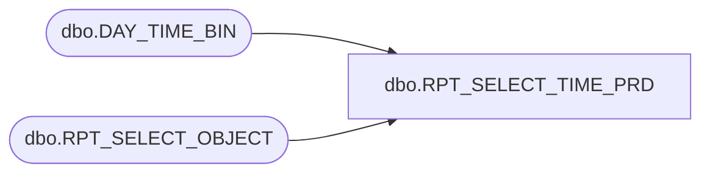

# dbo.RPT_SELECT_TIME_PRD

**Database:** USICOAL  
**Server:** bedrockdb02  

## Architecture Diagram



## Table Dependencies

| Referenced Table |
|---|
| dbo.DAY_TIME_BIN |
| dbo.RPT_SELECT_OBJECT |

## Stored Procedure Code

```sql

```

