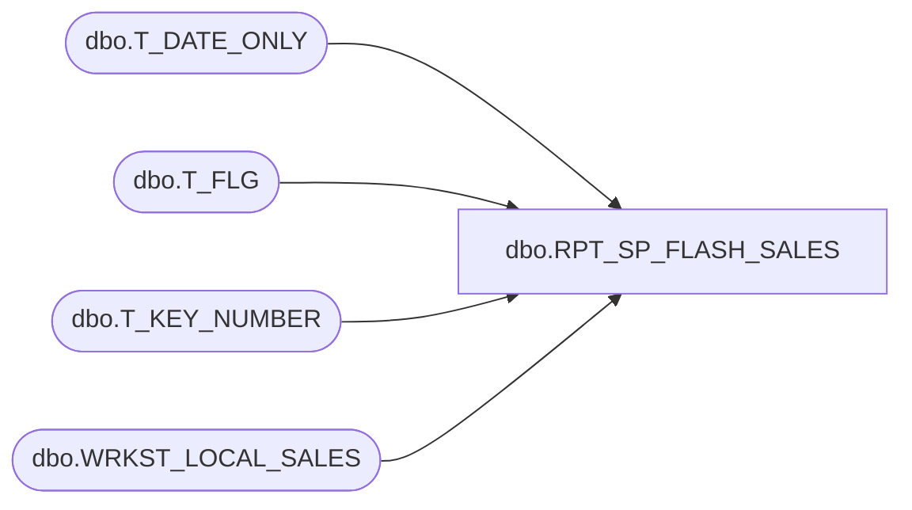

# dbo.RPT_SP_FLASH_SALES

**Database:** USICOAL  
**Server:** bedrockdb02  

## Architecture Diagram



## Table Dependencies

| Referenced Table |
|---|
| dbo.T_DATE_ONLY |
| dbo.T_FLG |
| dbo.T_KEY_NUMBER |
| dbo.WRKST_LOCAL_SALES |

## Stored Procedure Code

```sql

```

