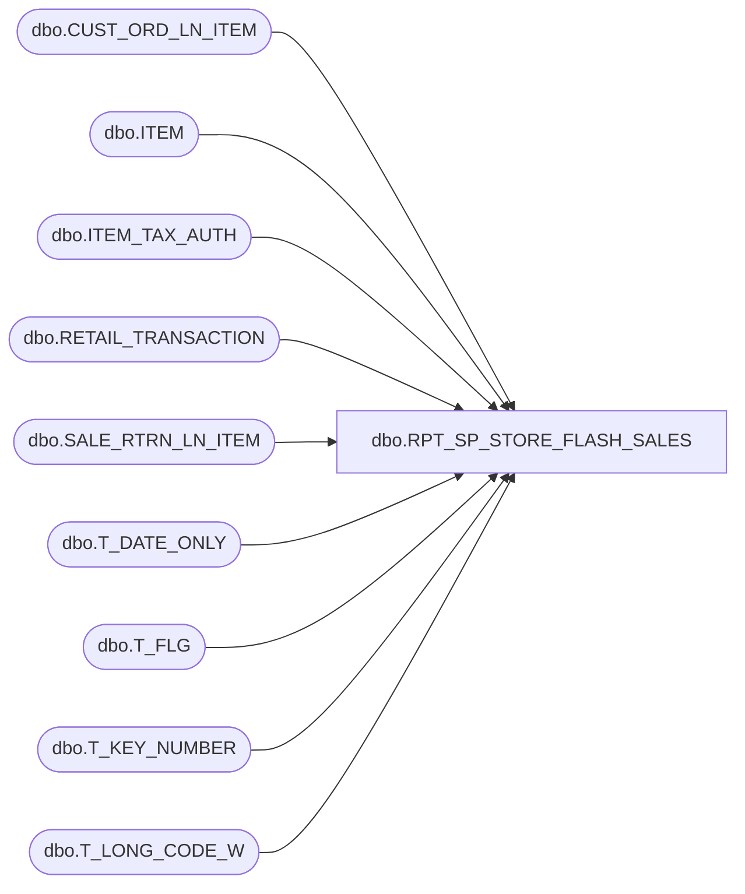

# dbo.RPT_SP_STORE_FLASH_SALES

**Database:** USICOAL  
**Server:** bedrockdb02  

## Architecture Diagram



## Table Dependencies

| Referenced Table |
|---|
| dbo.CUST_ORD_LN_ITEM |
| dbo.ITEM |
| dbo.ITEM_TAX_AUTH |
| dbo.RETAIL_TRANSACTION |
| dbo.SALE_RTRN_LN_ITEM |
| dbo.T_DATE_ONLY |
| dbo.T_FLG |
| dbo.T_KEY_NUMBER |
| dbo.T_LONG_CODE_W |

## Stored Procedure Code

```sql

```

