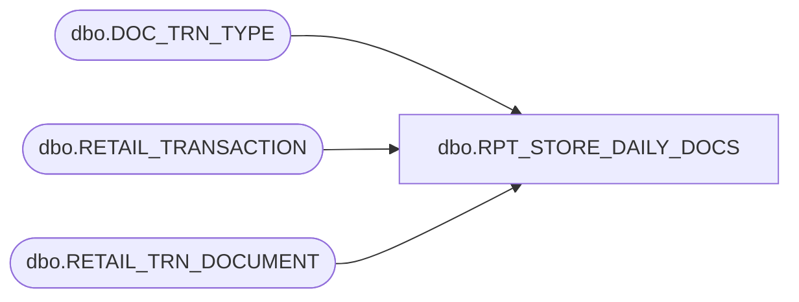

# dbo.RPT_STORE_DAILY_DOCS

**Database:** USICOAL  
**Server:** bedrockdb02  

## Architecture Diagram



## Table Dependencies

| Referenced Table |
|---|
| dbo.DOC_TRN_TYPE |
| dbo.RETAIL_TRANSACTION |
| dbo.RETAIL_TRN_DOCUMENT |

## Stored Procedure Code

```sql

```

