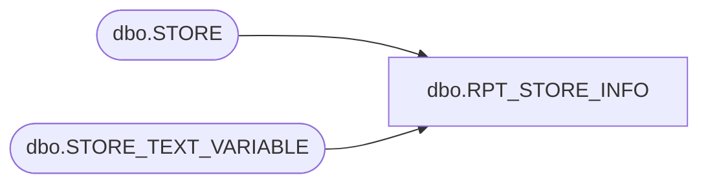

# dbo.RPT_STORE_INFO

**Database:** USICOAL  
**Server:** bedrockdb02  

## Architecture Diagram



## Table Dependencies

| Referenced Table |
|---|
| dbo.STORE |
| dbo.STORE_TEXT_VARIABLE |

## Stored Procedure Code

```sql

```

