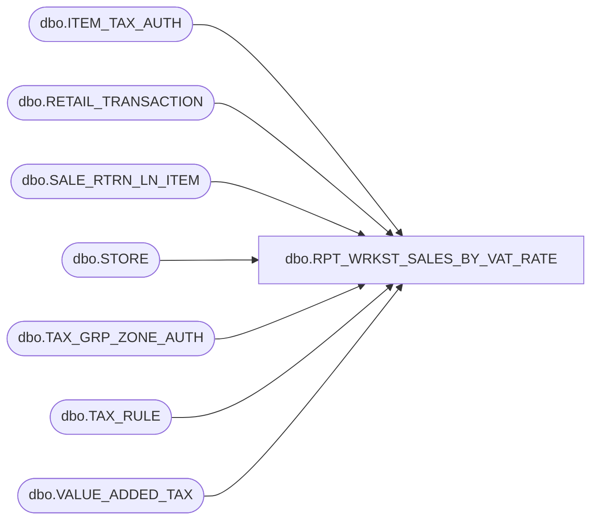

# dbo.RPT_WRKST_SALES_BY_VAT_RATE

**Database:** USICOAL  
**Server:** bedrockdb02  

## Architecture Diagram



## Table Dependencies

| Referenced Table |
|---|
| dbo.ITEM_TAX_AUTH |
| dbo.RETAIL_TRANSACTION |
| dbo.SALE_RTRN_LN_ITEM |
| dbo.STORE |
| dbo.TAX_GRP_ZONE_AUTH |
| dbo.TAX_RULE |
| dbo.VALUE_ADDED_TAX |

## Stored Procedure Code

```sql

```

