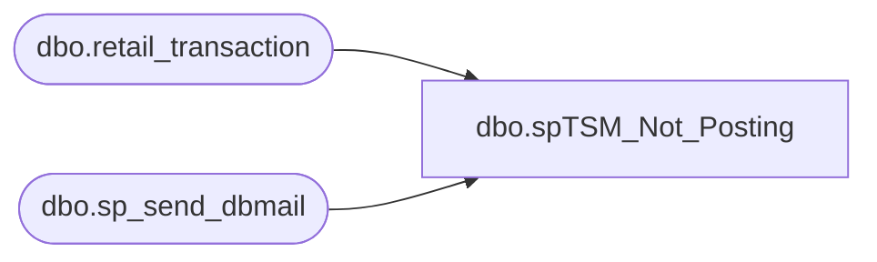

# dbo.spTSM_Not_Posting

**Database:** USICOAL  
**Server:** bedrockdb02  

## Architecture Diagram



## Table Dependencies

| Referenced Table |
|---|
| dbo.retail_transaction |
| dbo.sp_send_dbmail |

## Stored Procedure Code

```sql

```

