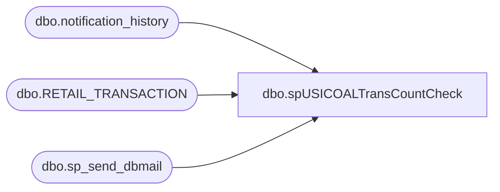

# dbo.spUSICOALTransCountCheck

**Database:** USICOAL  
**Server:** bedrockdb02  

## Architecture Diagram



## Table Dependencies

| Referenced Table |
|---|
| dbo.notification_history |
| dbo.RETAIL_TRANSACTION |
| dbo.sp_send_dbmail |

## Stored Procedure Code

```sql

```

