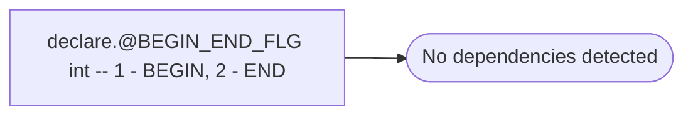

# declare.@BEGIN_END_FLG int -- 1 - BEGIN, 2 - END

**Database:** USICOAL  
**Server:** bedrockdb02  

## Architecture Diagram



## Table Dependencies

_No table references detected._

## Stored Procedure Code

```sql

```

