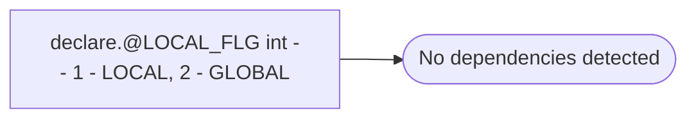

# declare.@LOCAL_FLG int -- 1 - LOCAL, 2 - GLOBAL

**Database:** USICOAL  
**Server:** bedrockdb02  

## Architecture Diagram



## Table Dependencies

_No table references detected._

## Stored Procedure Code

```sql

```

