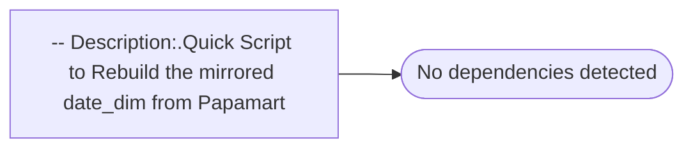

# -- Description:.Quick Script to Rebuild the mirrored date_dim from Papamart

**Database:** dw_mirror  
**Server:** bedrockdb02  

## Architecture Diagram



## Table Dependencies

_No table references detected._

## Stored Procedure Code

```sql

```

