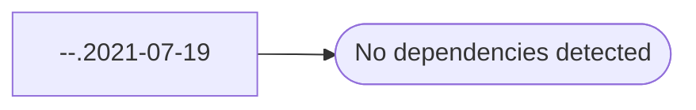

# --.2021-07-19

**Database:** esell  
**Server:** bedrockdb02  

## Architecture Diagram



## Table Dependencies

_No table references detected._

## Stored Procedure Code

```sql
Tim Callahan - Updated DigitalSoundsStyles CTE to match same criteria we use for push to Deck OMS
```

