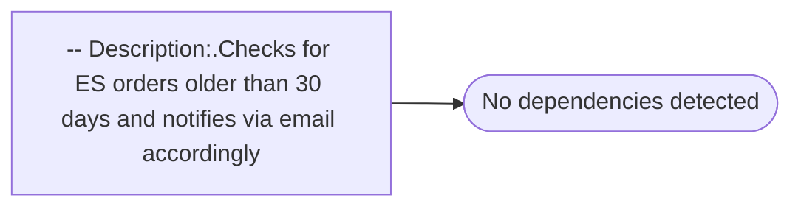

# -- Description:.Checks for ES orders older than 30 days and notifies via email accordingly

**Database:** esell  
**Server:** bedrockdb02  

## Architecture Diagram



## Table Dependencies

_No table references detected._

## Stored Procedure Code

```sql

```

