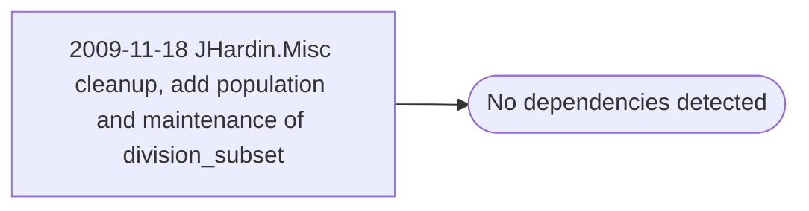

# 2009-11-18 JHardin.Misc cleanup, add population and maintenance of division_subset

**Database:** esell  
**Server:** bedrockdb02  

## Architecture Diagram



## Table Dependencies

_No table references detected._

## Stored Procedure Code

```sql

```

