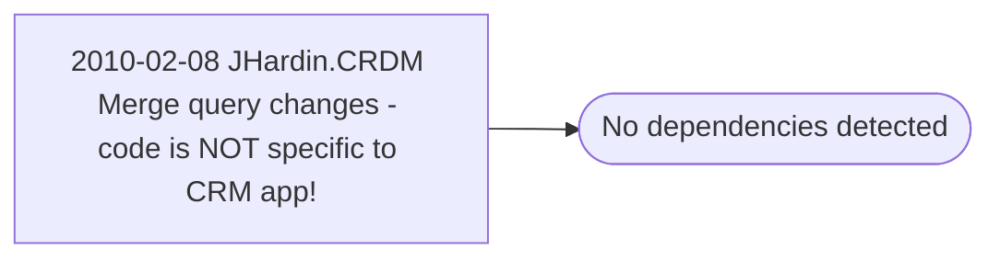

# 2010-02-08 JHardin.CRDM Merge query changes - code is NOT specific to CRM app!

**Database:** esell  
**Server:** bedrockdb02  

## Architecture Diagram



## Table Dependencies

_No table references detected._

## Stored Procedure Code

```sql

```

