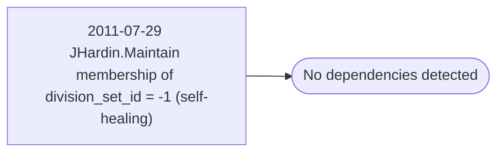

# 2011-07-29 JHardin.Maintain membership of division_set_id = -1 (self-healing)

**Database:** esell  
**Server:** bedrockdb02  

## Architecture Diagram



## Table Dependencies

_No table references detected._

## Stored Procedure Code

```sql

```

