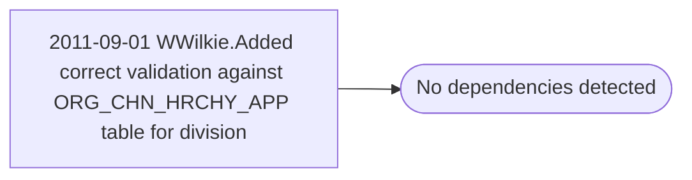

# 2011-09-01 WWilkie.Added correct validation against ORG_CHN_HRCHY_APP table for division

**Database:** esell  
**Server:** bedrockdb02  

## Architecture Diagram



## Table Dependencies

_No table references detected._

## Stored Procedure Code

```sql

```

