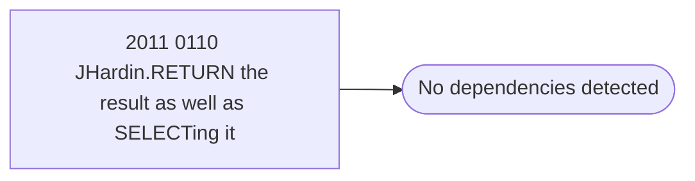

# 2011 0110 JHardin.RETURN the result as well as SELECTing it

**Database:** esell  
**Server:** bedrockdb02  

## Architecture Diagram



## Table Dependencies

_No table references detected._

## Stored Procedure Code

```sql

```

