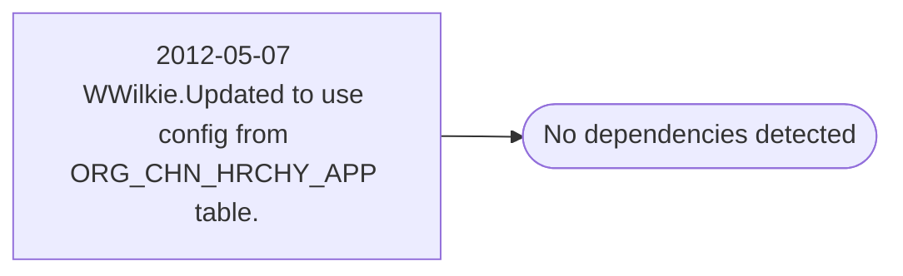

# 2012-05-07 WWilkie.Updated to use config from ORG_CHN_HRCHY_APP table.

**Database:** esell  
**Server:** bedrockdb02  

## Architecture Diagram



## Table Dependencies

_No table references detected._

## Stored Procedure Code

```sql

```

