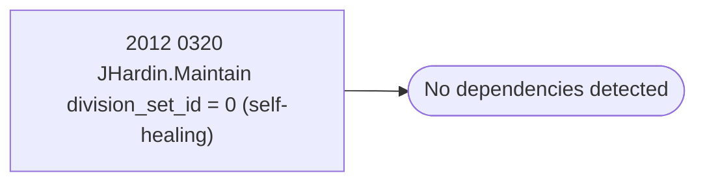

# 2012 0320 JHardin.Maintain division_set_id = 0 (self-healing)

**Database:** esell  
**Server:** bedrockdb02  

## Architecture Diagram



## Table Dependencies

_No table references detected._

## Stored Procedure Code

```sql

```

