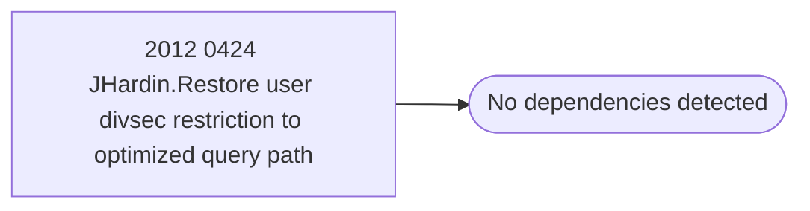

# 2012 0424 JHardin.Restore user divsec restriction to optimized query path

**Database:** esell  
**Server:** bedrockdb02  

## Architecture Diagram



## Table Dependencies

_No table references detected._

## Stored Procedure Code

```sql

```

