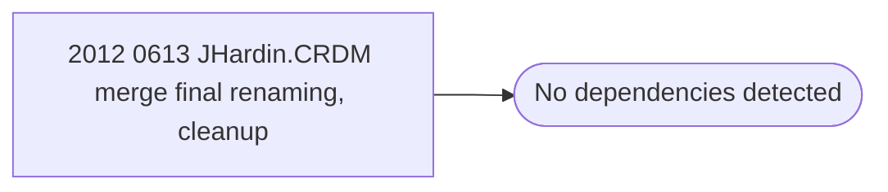

# 2012 0613 JHardin.CRDM merge final renaming, cleanup

**Database:** esell  
**Server:** bedrockdb02  

## Architecture Diagram



## Table Dependencies

_No table references detected._

## Stored Procedure Code

```sql

```

