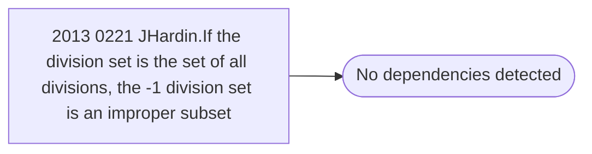

# 2013 0221 JHardin.If the division set is the set of all divisions, the -1 division set is an improper subset

**Database:** esell  
**Server:** bedrockdb02  

## Architecture Diagram



## Table Dependencies

_No table references detected._

## Stored Procedure Code

```sql

```

