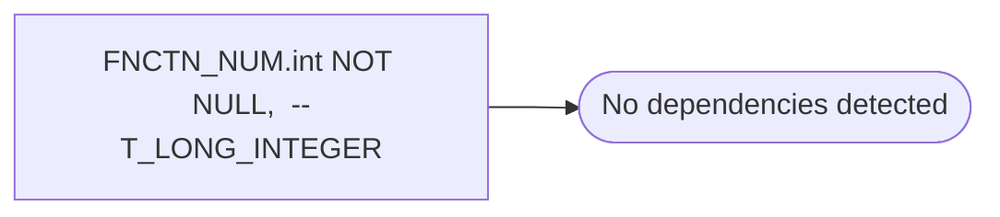

# FNCTN_NUM.int NOT NULL,  --T_LONG_INTEGER

**Database:** esell  
**Server:** bedrockdb02  

## Architecture Diagram



## Table Dependencies

_No table references detected._

## Stored Procedure Code

```sql

```

