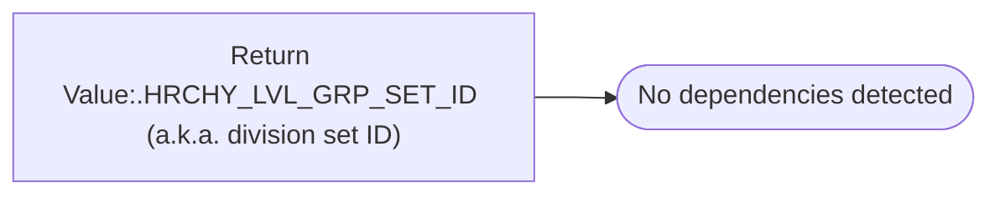

# Return Value:.HRCHY_LVL_GRP_SET_ID (a.k.a. division set ID)

**Database:** esell  
**Server:** bedrockdb02  

## Architecture Diagram



## Table Dependencies

_No table references detected._

## Stored Procedure Code

```sql

```

