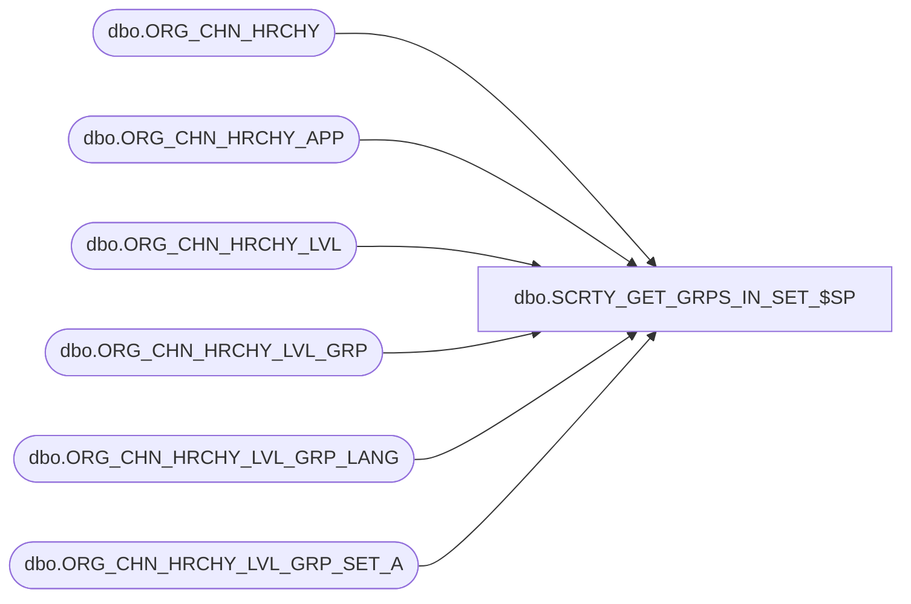

# dbo.SCRTY_GET_GRPS_IN_SET_$SP

**Database:** esell  
**Server:** bedrockdb02  

## Architecture Diagram



## Table Dependencies

| Referenced Table |
|---|
| dbo.ORG_CHN_HRCHY |
| dbo.ORG_CHN_HRCHY_APP |
| dbo.ORG_CHN_HRCHY_LVL |
| dbo.ORG_CHN_HRCHY_LVL_GRP |
| dbo.ORG_CHN_HRCHY_LVL_GRP_LANG |
| dbo.ORG_CHN_HRCHY_LVL_GRP_SET_A |

## Stored Procedure Code

```sql

```

