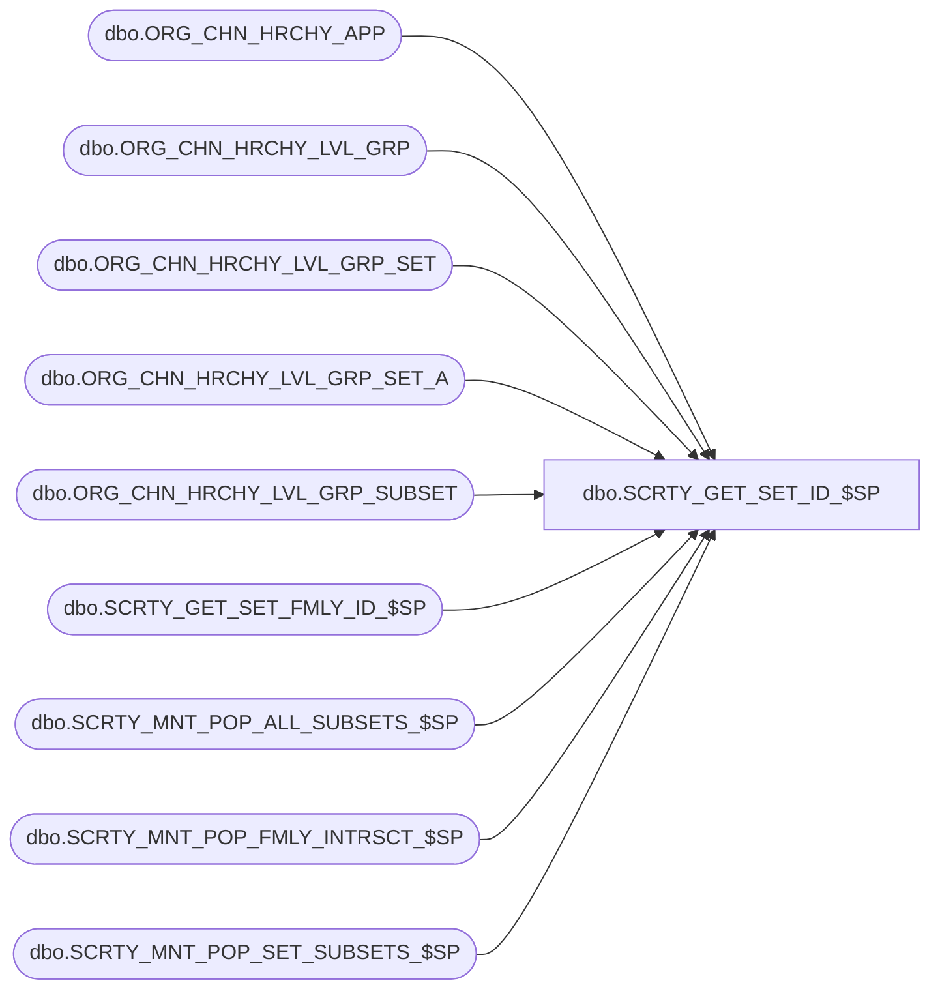

# dbo.SCRTY_GET_SET_ID_$SP

**Database:** esell  
**Server:** bedrockdb02  

## Architecture Diagram



## Table Dependencies

| Referenced Table |
|---|
| dbo.ORG_CHN_HRCHY_APP |
| dbo.ORG_CHN_HRCHY_LVL_GRP |
| dbo.ORG_CHN_HRCHY_LVL_GRP_SET |
| dbo.ORG_CHN_HRCHY_LVL_GRP_SET_A |
| dbo.ORG_CHN_HRCHY_LVL_GRP_SUBSET |
| dbo.SCRTY_GET_SET_FMLY_ID_$SP |
| dbo.SCRTY_MNT_POP_ALL_SUBSETS_$SP |
| dbo.SCRTY_MNT_POP_FMLY_INTRSCT_$SP |
| dbo.SCRTY_MNT_POP_SET_SUBSETS_$SP |

## Stored Procedure Code

```sql

```

