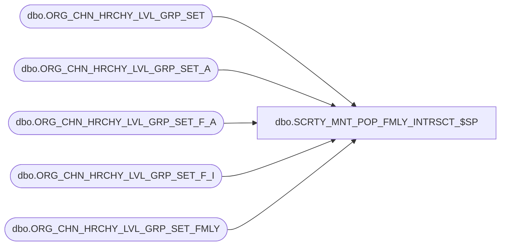

# dbo.SCRTY_MNT_POP_FMLY_INTRSCT_$SP

**Database:** esell  
**Server:** bedrockdb02  

## Architecture Diagram



## Table Dependencies

| Referenced Table |
|---|
| dbo.ORG_CHN_HRCHY_LVL_GRP_SET |
| dbo.ORG_CHN_HRCHY_LVL_GRP_SET_A |
| dbo.ORG_CHN_HRCHY_LVL_GRP_SET_F_A |
| dbo.ORG_CHN_HRCHY_LVL_GRP_SET_F_I |
| dbo.ORG_CHN_HRCHY_LVL_GRP_SET_FMLY |

## Stored Procedure Code

```sql

```

