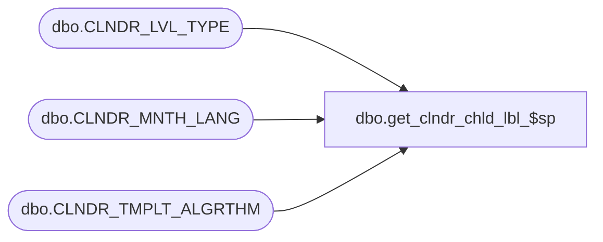

# dbo.get_clndr_chld_lbl_$sp

**Database:** esell  
**Server:** bedrockdb02  

## Architecture Diagram



## Table Dependencies

| Referenced Table |
|---|
| dbo.CLNDR_LVL_TYPE |
| dbo.CLNDR_MNTH_LANG |
| dbo.CLNDR_TMPLT_ALGRTHM |

## Stored Procedure Code

```sql
create proc [dbo].[get_clndr_chld_lbl_$sp]
```

