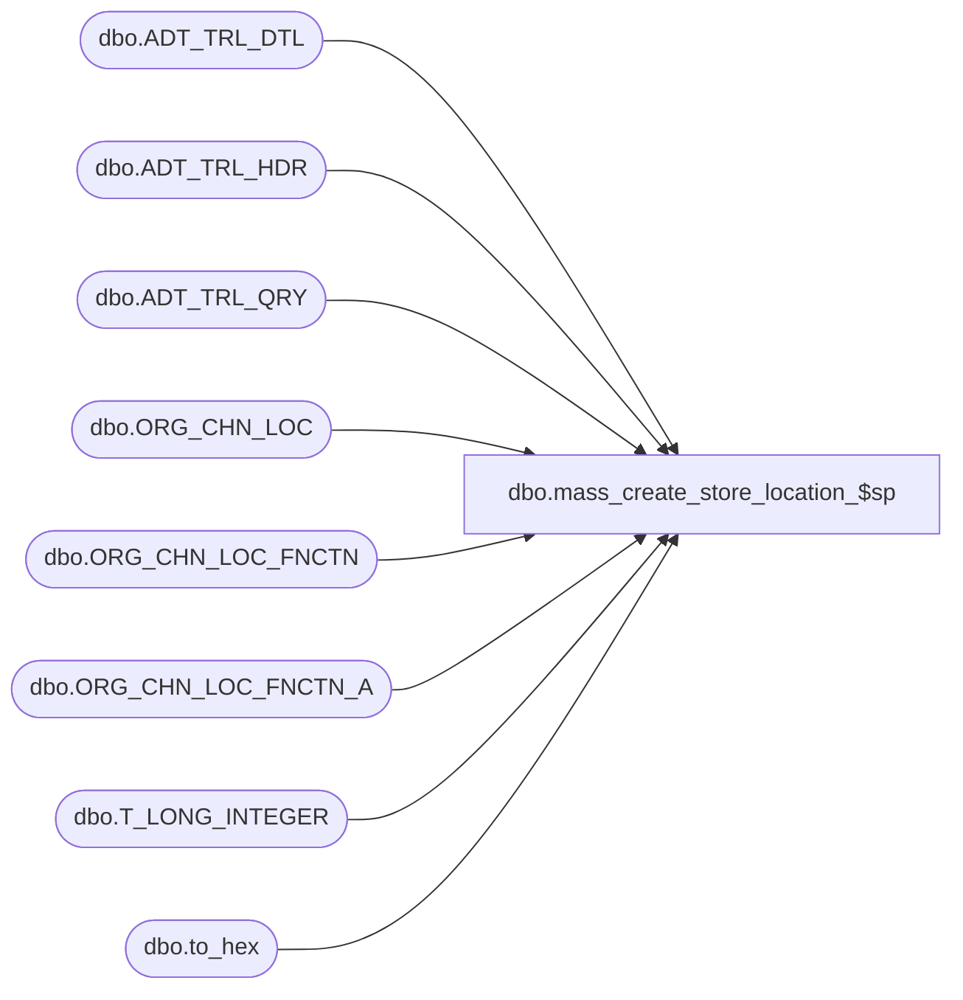

# dbo.mass_create_store_location_$sp

**Database:** esell  
**Server:** bedrockdb02  

## Architecture Diagram



## Table Dependencies

| Referenced Table |
|---|
| dbo.ADT_TRL_DTL |
| dbo.ADT_TRL_HDR |
| dbo.ADT_TRL_QRY |
| dbo.ORG_CHN_LOC |
| dbo.ORG_CHN_LOC_FNCTN |
| dbo.ORG_CHN_LOC_FNCTN_A |
| dbo.T_LONG_INTEGER |
| dbo.to_hex |

## Stored Procedure Code

```sql

```

