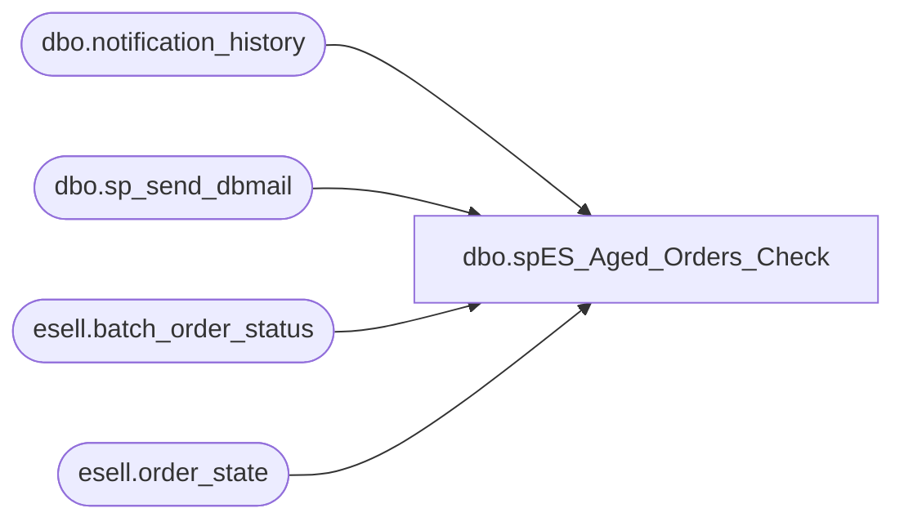

# dbo.spES_Aged_Orders_Check

**Database:** esell  
**Server:** bedrockdb02  

## Architecture Diagram



## Table Dependencies

| Referenced Table |
|---|
| dbo.notification_history |
| dbo.sp_send_dbmail |
| esell.batch_order_status |
| esell.order_state |

## Stored Procedure Code

```sql

```

