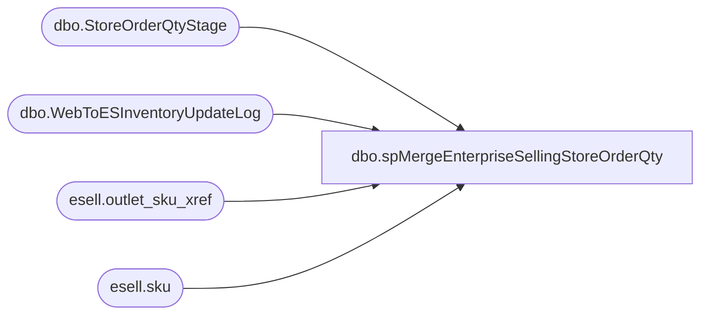

# dbo.spMergeEnterpriseSellingStoreOrderQty

**Database:** esell  
**Server:** bedrockdb02  

## Architecture Diagram



## Table Dependencies

| Referenced Table |
|---|
| dbo.StoreOrderQtyStage |
| dbo.WebToESInventoryUpdateLog |
| esell.outlet_sku_xref |
| esell.sku |

## Stored Procedure Code

```sql

```

