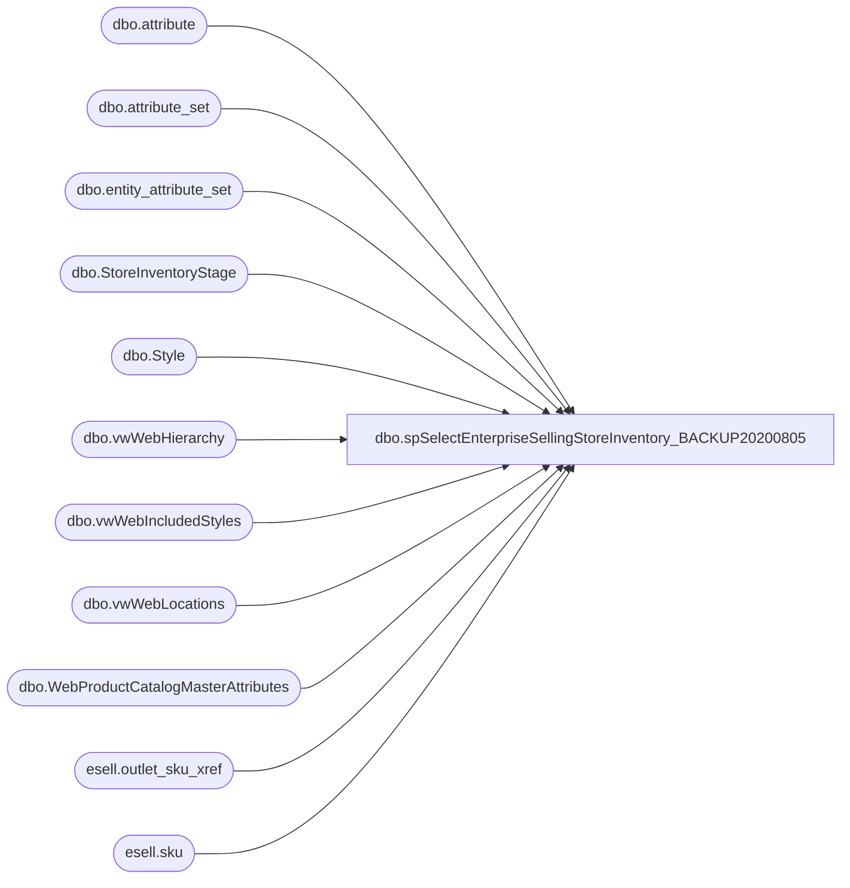

# dbo.spSelectEnterpriseSellingStoreInventory_BACKUP20200805

**Database:** esell  
**Server:** bedrockdb02  

## Architecture Diagram



## Table Dependencies

| Referenced Table |
|---|
| dbo.attribute |
| dbo.attribute_set |
| dbo.entity_attribute_set |
| dbo.StoreInventoryStage |
| dbo.Style |
| dbo.vwWebHierarchy |
| dbo.vwWebIncludedStyles |
| dbo.vwWebLocations |
| dbo.WebProductCatalogMasterAttributes |
| esell.outlet_sku_xref |
| esell.sku |

## Stored Procedure Code

```sql

```

