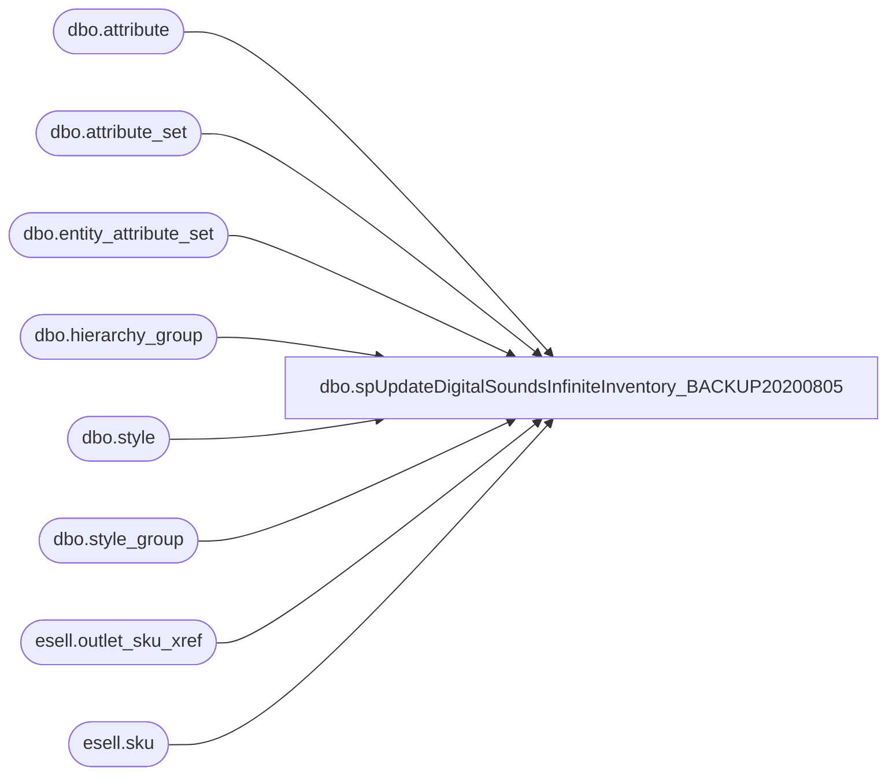

# dbo.spUpdateDigitalSoundsInfiniteInventory_BACKUP20200805

**Database:** esell  
**Server:** bedrockdb02  

## Architecture Diagram



## Table Dependencies

| Referenced Table |
|---|
| dbo.attribute |
| dbo.attribute_set |
| dbo.entity_attribute_set |
| dbo.hierarchy_group |
| dbo.style |
| dbo.style_group |
| esell.outlet_sku_xref |
| esell.sku |

## Stored Procedure Code

```sql

```

