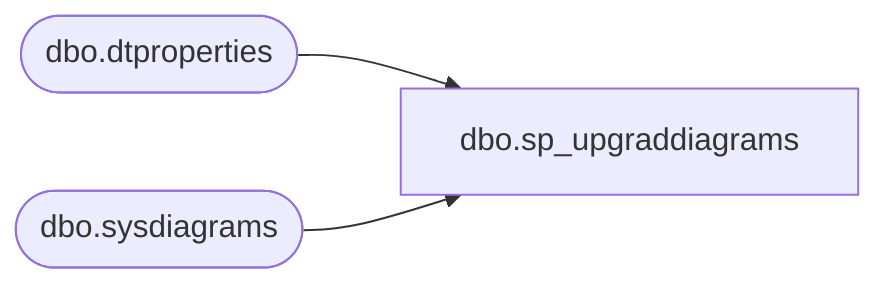

# dbo.sp_upgraddiagrams

**Database:** esell  
**Server:** bedrockdb02  

## Architecture Diagram



## Table Dependencies

| Referenced Table |
|---|
| dbo.dtproperties |
| dbo.sysdiagrams |

## Stored Procedure Code

```sql

```

