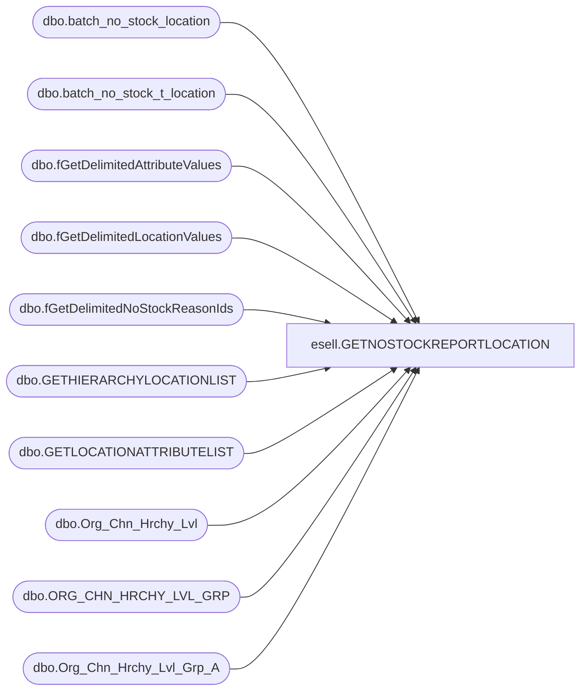

# esell.GETNOSTOCKREPORTLOCATION

**Database:** esell  
**Server:** bedrockdb02  

## Architecture Diagram



## Table Dependencies

| Referenced Table |
|---|
| dbo.batch_no_stock_location |
| dbo.batch_no_stock_t_location |
| dbo.fGetDelimitedAttributeValues |
| dbo.fGetDelimitedLocationValues |
| dbo.fGetDelimitedNoStockReasonIds |
| dbo.GETHIERARCHYLOCATIONLIST |
| dbo.GETLOCATIONATTRIBUTELIST |
| dbo.Org_Chn_Hrchy_Lvl |
| dbo.ORG_CHN_HRCHY_LVL_GRP |
| dbo.Org_Chn_Hrchy_Lvl_Grp_A |

## Stored Procedure Code

```sql

```

