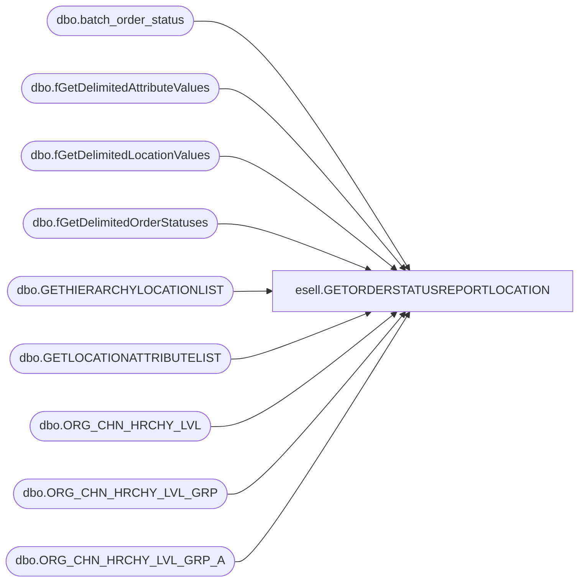

# esell.GETORDERSTATUSREPORTLOCATION

**Database:** esell  
**Server:** bedrockdb02  

## Architecture Diagram



## Table Dependencies

| Referenced Table |
|---|
| dbo.batch_order_status |
| dbo.fGetDelimitedAttributeValues |
| dbo.fGetDelimitedLocationValues |
| dbo.fGetDelimitedOrderStatuses |
| dbo.GETHIERARCHYLOCATIONLIST |
| dbo.GETLOCATIONATTRIBUTELIST |
| dbo.ORG_CHN_HRCHY_LVL |
| dbo.ORG_CHN_HRCHY_LVL_GRP |
| dbo.ORG_CHN_HRCHY_LVL_GRP_A |

## Stored Procedure Code

```sql
--START GETORDERSTATUSREPORTLOCATION--
```

