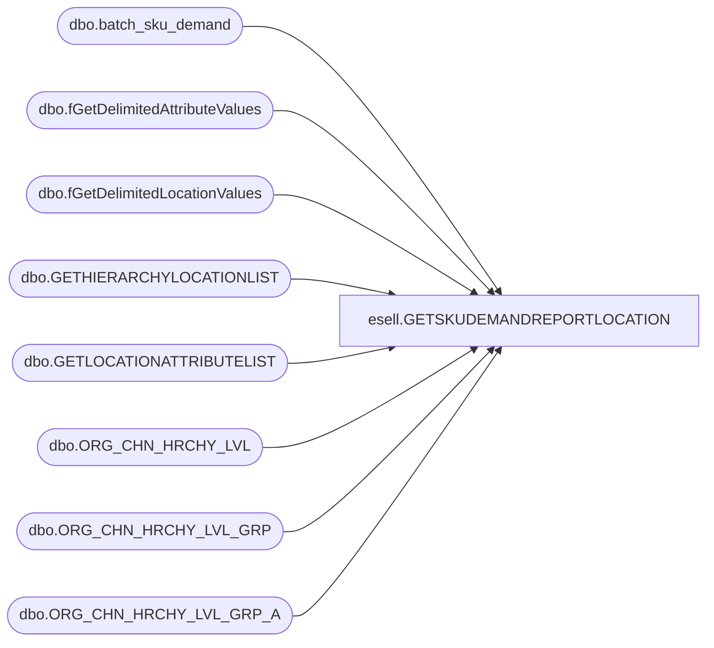

# esell.GETSKUDEMANDREPORTLOCATION

**Database:** esell  
**Server:** bedrockdb02  

## Architecture Diagram



## Table Dependencies

| Referenced Table |
|---|
| dbo.batch_sku_demand |
| dbo.fGetDelimitedAttributeValues |
| dbo.fGetDelimitedLocationValues |
| dbo.GETHIERARCHYLOCATIONLIST |
| dbo.GETLOCATIONATTRIBUTELIST |
| dbo.ORG_CHN_HRCHY_LVL |
| dbo.ORG_CHN_HRCHY_LVL_GRP |
| dbo.ORG_CHN_HRCHY_LVL_GRP_A |

## Stored Procedure Code

```sql
--END GETSKUDEMANDREPORT--
```

