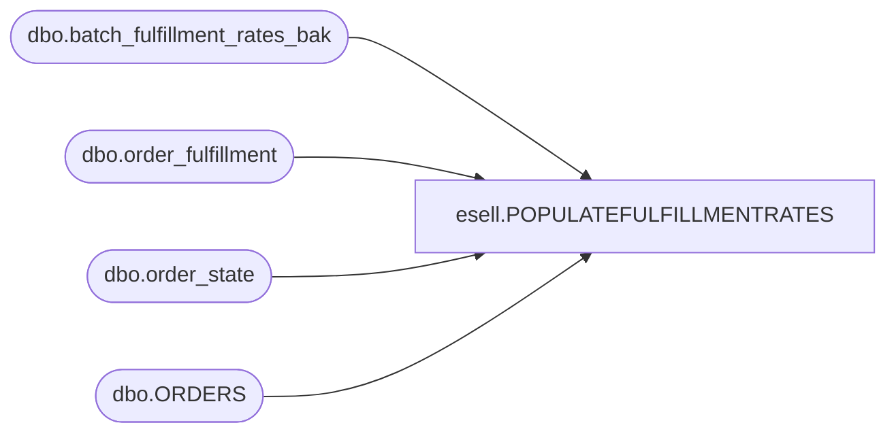

# esell.POPULATEFULFILLMENTRATES

**Database:** esell  
**Server:** bedrockdb02  

## Architecture Diagram



## Table Dependencies

| Referenced Table |
|---|
| dbo.batch_fulfillment_rates_bak |
| dbo.order_fulfillment |
| dbo.order_state |
| dbo.ORDERS |

## Stored Procedure Code

```sql

```

