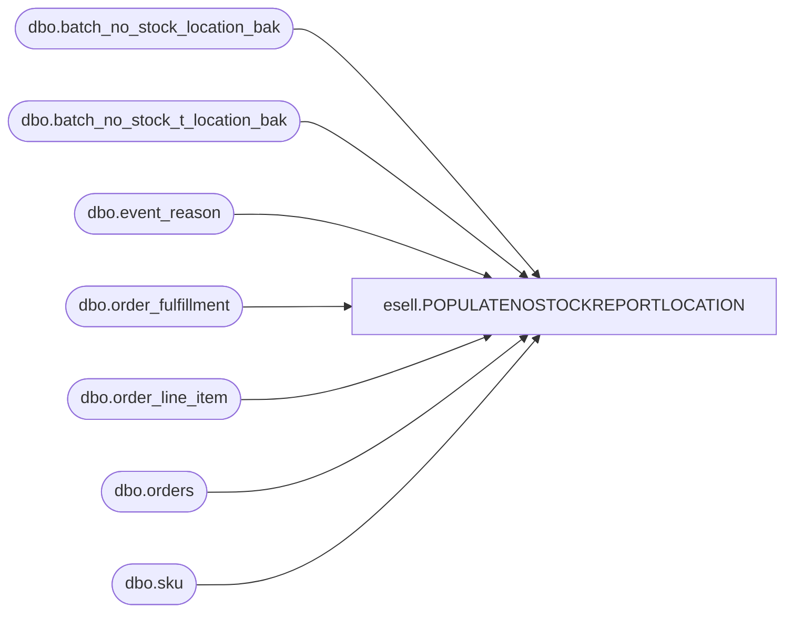

# esell.POPULATENOSTOCKREPORTLOCATION

**Database:** esell  
**Server:** bedrockdb02  

## Architecture Diagram



## Table Dependencies

| Referenced Table |
|---|
| dbo.batch_no_stock_location_bak |
| dbo.batch_no_stock_t_location_bak |
| dbo.event_reason |
| dbo.order_fulfillment |
| dbo.order_line_item |
| dbo.orders |
| dbo.sku |

## Stored Procedure Code

```sql
--END POPULATENOSTOCKREPORT--
```

