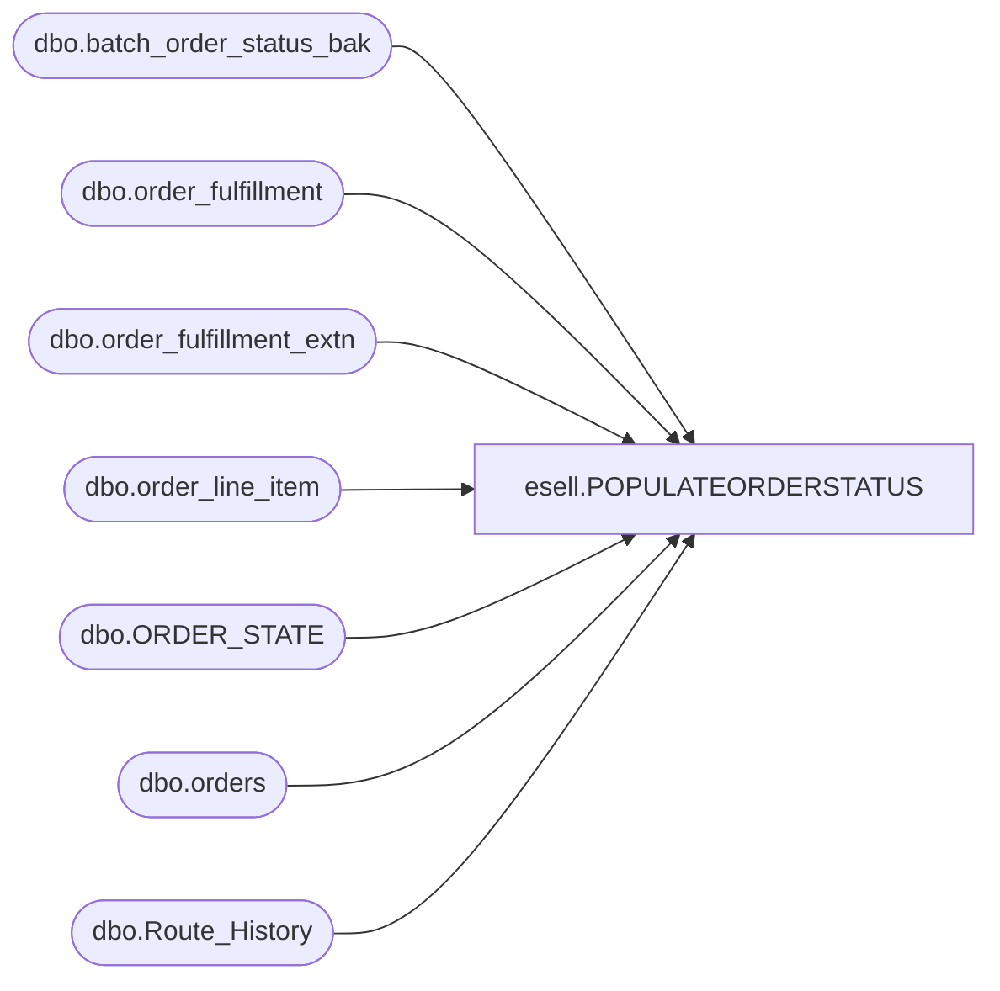

# esell.POPULATEORDERSTATUS

**Database:** esell  
**Server:** bedrockdb02  

## Architecture Diagram



## Table Dependencies

| Referenced Table |
|---|
| dbo.batch_order_status_bak |
| dbo.order_fulfillment |
| dbo.order_fulfillment_extn |
| dbo.order_line_item |
| dbo.ORDER_STATE |
| dbo.orders |
| dbo.Route_History |

## Stored Procedure Code

```sql
--Start 146561
```

