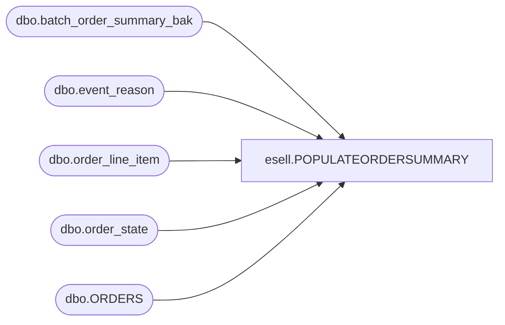

# esell.POPULATEORDERSUMMARY

**Database:** esell  
**Server:** bedrockdb02  

## Architecture Diagram



## Table Dependencies

| Referenced Table |
|---|
| dbo.batch_order_summary_bak |
| dbo.event_reason |
| dbo.order_line_item |
| dbo.order_state |
| dbo.ORDERS |

## Stored Procedure Code

```sql
--END POPULATEORDERSTATUS--
```

