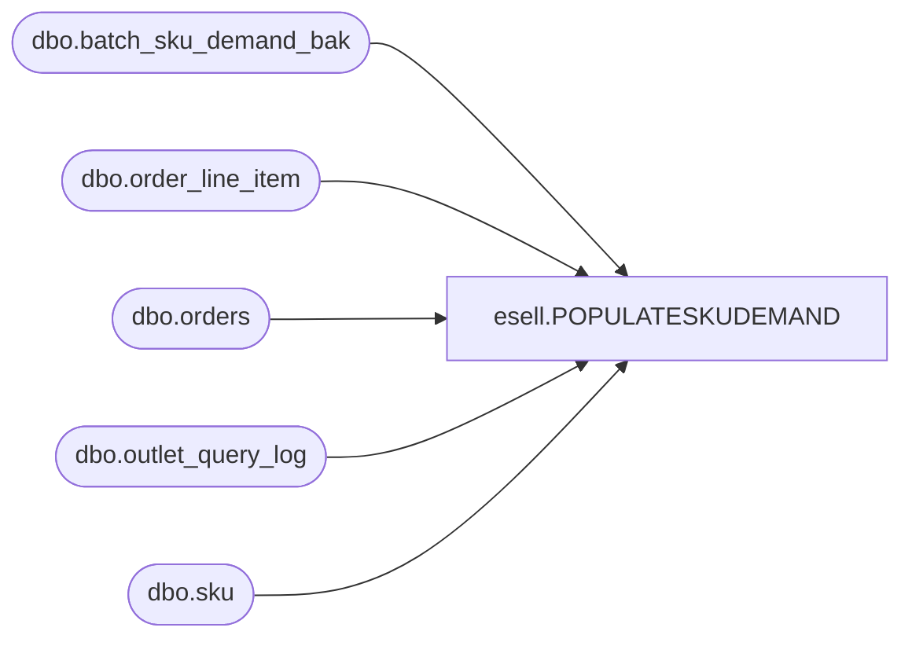

# esell.POPULATESKUDEMAND

**Database:** esell  
**Server:** bedrockdb02  

## Architecture Diagram



## Table Dependencies

| Referenced Table |
|---|
| dbo.batch_sku_demand_bak |
| dbo.order_line_item |
| dbo.orders |
| dbo.outlet_query_log |
| dbo.sku |

## Stored Procedure Code

```sql
--END PopulateOrderSummary--
```

