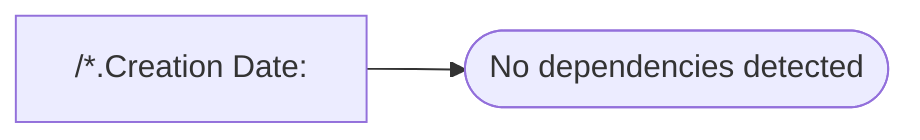

# /*.Creation Date:

**Database:** fn_01  
**Server:** bedrockdb02  

## Architecture Diagram



## Table Dependencies

_No table references detected._

## Stored Procedure Code

```sql
17-Sept-2002 & May 2004
```

