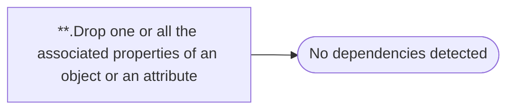

# **.Drop one or all the associated properties of an object or an attribute

**Database:** fn_01  
**Server:** bedrockdb02  

## Architecture Diagram



## Table Dependencies

_No table references detected._

## Stored Procedure Code

```sql

```

